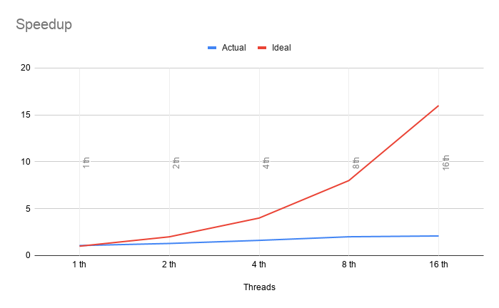
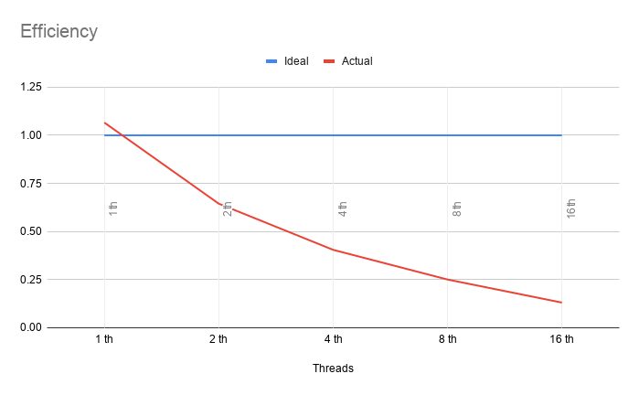

# Monte Carlo Pi - Secuencial y Paralelo

- David Mejía Restrepo

## Introducción
El algoritmo viene del metodo de Monte Carlo que se puede usar para calcular un aproximado el numero *Pi*. **¿Cómo lo hace?** se tiene un cuadraro de lado *2r* un circulo dentro del cuadrado de radio *r*, luego se toman puntos aleatorios dentro del cuadrado y se revisa si el punto esta dentro o no del circulo[*Figura 1*], ahora para realizar el calculo de *Pi* se hace referencia a la formula en la [*Figura 2*].
<div align='center'>
    </br>
    </br><i>Figura 1. Ilustración metodo Monte Carlo.</i>
    </br></br>
    </br><i>Figura 2. Formula metodo Monte Carlo.</i>
    </br></br>
</div>

El algoritmo en la *Figura 3* se encarga de generar **p** cantidad de puntos con unas cordenadas dadas en **x** y **y**, luego se asegura que la hipotenusa del triangulo rectangulo que forman estos puntos sea menor o igual a 1 y de esta forma asegurar que este dentro del circulo, luego si esto se cumple, se encarga de sumar 1 a **counter** para saber cuantos puntos se obtuvieron dentro del circulo. [*Figura 4*]

``` c
double montecarlo_seq (int p) {  
  int i, counter = 0;
  double x, y, z, pi;

  // Computation of pi
  for(i = 0; i < p; ++i) {
    x = (double)rand() / RAND_MAX;
    y = (double)rand() / RAND_MAX;
    z = x * x + y * y;
    if( z <= 1 ) counter++;
  }
  pi = (double) counter / p * 4;

  return pi;
}
``` 
*Figura 3. Código Secuencial Monte Carlo.*

<div align='center'>
    
    </br><i>Figura 4. Cálculo del metodo Monte Carlo.</i>
    </br></br>
</div>

## Método

Para realizar la paralelización del metodo Jacobi, se utilizo la API de **OpenMP**, buscando la mejor distribucion de los datos entre los hilos para alcanzar el maximo desempeño posible por este metodo.

Para la implementación de la paralelización del codigo en el archivo *code/jacobi.c* se realizo en primera instancia un perfilamiento del codigo, donde se evidencio que la seccion de codigo que requera más capacidad de computo correspondia a la funcion *jacobi* mostrada en la *Figura 1*.
``` c
void jacobi ( int n, int m, double dx, double dy, double alpha, double omega, double *u, double *f, double tol, int maxit, int n_threads )
{
    int i,j,k;
    double error, resid, ax, ay, b;
    double *uold;

    uold = (double *) malloc(sizeof(double)*n*m);
    if (!uold)
    {
        fprintf(stderr, "Error: cant allocate memory\n");
        exit(1);
    }
    ax = 1.0/(dx * dx); /* X-direction coef */
    ay = 1.0/(dy*dy); /* Y_direction coef */
    b = -2.0/(dx*dx)-2.0/(dy*dy) - alpha; /* Central coeff */
    error = 10.0 * tol;
    k = 1;
    while (k <= maxit && error > tol) 
    {
        error = 0.0;
        /* copy new solution into old */
        for (j=0; j<m; j++)
            for (i=0; i<n; i++)
            {
                UOLD(j,i) = U(j,i);
            }
        /* compute stencil, residual and update */
        for (j=1; j<m-1; j++)
        {
            for (i=1; i<n-1; i++)
            {
                resid = (
                    ax * (UOLD(j,i-1) + UOLD(j,i+1))
                    + ay * (UOLD(j-1,i) + UOLD(j+1,i))
                    + b * UOLD(j,i) - F(j,i)
                    ) / b;
                /* update solution */
                U(j,i) = UOLD(j,i) - omega * resid;
                /* accumulate residual error */
                error =error + resid*resid;
            }
        }
        /* error check */
        k++;
        error = sqrt(error) /(n*m);
    } /* while */
    printf("Total Number of Iterations %d\n", k);
    printf("Residual %.15g\n", error);
}
```
*Figura 1. Funcion secuencial jacobi.*

Haciendo pruebas y analizando el problema se realizaron multipes codigos parallelos abordando diferentes posibles soluciones al problema como un paralelismo utilizando *tasks* y asignando una fraccion de los ciclos a cada hilo, en estas se abordo paralelizar las iteraciones realizdas en la función en *while (k <= maxit && error > tol)* y en el ciclo for correspndiente a *compute stencil, residual and update*. Despues de analizar los multiples metodos posibles se opto por no utilizar *tasks* y por paralelizar unicamente el ciclo for correspondiente a *compute stencil, residual and update* dado que es el que presentaba un mejor desempeño. La paralelizacion de esta seccion se muestra en la *figura 2*.

``` c
//Start parallel region
int local_m, local_j, my_rank, size;
size = (m - 2) / n_threads;
#pragma omp parallel \
    num_threads(n_threads) \
    private (i, resid, my_rank, local_j, local_m ) \
    reduction (+:error)
{
    my_rank = omp_get_thread_num();
    local_m = size*(my_rank+1);
    local_j = (size*my_rank)+1;
    
    if (my_rank == (n_threads - 1))
        local_m += (m-2)%n_threads;
    
    /* compute stencil, residual and update */
    for (local_j; local_j<local_m; local_j++)
    {
        for (i=1; i<n-1; i++)
        {
            resid = (
                ax * (UOLD(local_j,i-1) + UOLD(local_j,i+1))
                + ay * (UOLD(local_j-1,i) + UOLD(local_j+1,i))
                + b * UOLD(local_j,i) - F(local_j,i)
                ) / b;
            /* update solution */
            U(local_j,i) = UOLD(local_j,i) - omega * resid;
            /* accumulate residual error */
            error += resid*resid;
        }
    }
}
```
*Figura 1. Funcion secuencial jacobi.*

## Resultados

Para las pruebas se realizaron 30 ejecuciones de la version secuencial del codigo y 30 de la version paralela para 1, 2, 4, 8 y 16 hilos, la semilla para los numeros aleatorio corresponde a **1** y la cantidad de puntos a evaluar corresponde a **100M** de puntos.

El promedio de tiempo de ejecucion y error para la version secuencial se presentan en la *Figura 6* y la *Figura 7*.

<div align='center'>
    
    </br><i>Figura 6. Tiempo de ejecucion promedio secuencial.</i>
    </br></br>
    
    </br><i>Figura 7. Error promedio secuencial.</i>
    </br></br>
</div>

---

Se presenta una tabla con los promedios con respecto a el tiempo de ejecución, el valor estimado de pi, el error de pi, el speedup y la eficiencia de la version paralela del programa en la *Tabla 1*, se entrega una grafica referente al speedup en la *Figura 8* y otra grafica referente a la eficiencia en la *Figura 9*.

| Threads | Execution time | Estimated value of pi | Pi error | Speedup | Efficiency |
|---|---|---|---|---|---|
| 1  | 1.410390 | 3.14156520 | 0.00002745358979305834 | 1.212184 | 1.212184 |
| 2  | 0.716609 | 3.14151692 | 0.00007573358979318101 | 2.385751 | 1.192876 |
| 4  | 0.364095 | 3.14157176 | 0.00002089358979295852 | 4.695619 | 1.173905 |
| 8  | 0.220137 | 3.14171376 | 0.00012110641020690593 | 7.766305 | 0.970788 |
| 16 | 0.225630 | 3.14149312 | 0.00009953358979331028 | 7.577242 | 0.473578 |

*Tabla 1. Promedio de los resultados.*

<div align='center'>
    
    </br><i>Figura 8. Speedup.</i>
    </br></br>
    
    </br><i>Figura 9. Efficiency.</i>
    </br></br>
</div>

## Conclusiones

Durante la paralelización del codigo se encontro una complicación al hacer un primer acercamiento a la paralelizacion del codigo, dado que como se menciono antes la funcion **rand()** no es thread-safe, lo cual hacia que al ejecutar el codigo en más de un hilo tardara hasta 10 veces más que el tiempo que toma el programa secuencial, haciendo el cambio a una funcion thread-safe como **rand_r()** no solo se obtuvo un desempeño esperado, en cambio se obtuvo un speedup super lineal, se puede inferir que es dado a que la funcion **rand_r()** consume mucho menos tiempo de ejecución que la función **rand()**, adicionalmente la paralelización que se realizo en el codigo se evidencia que requiere muy poca intervención sobre el algoritmo a ejecutar, en cambio la mayor parte del trabajo de paralelizacion se le atribuye a las directivas usadas. Haciendo un analizis más completo sobre los resultados obtenidos vemos que al menos en un escenario donde los puntos a evaluar son unicamente *100M* vemos que la eficiencia empieza a decaer notablemente cuando se utilizan 8 hilos y en mayor medida cuando se utilizan 16 hilos.